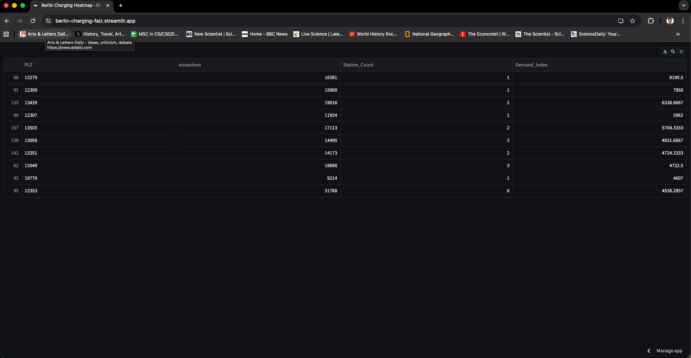
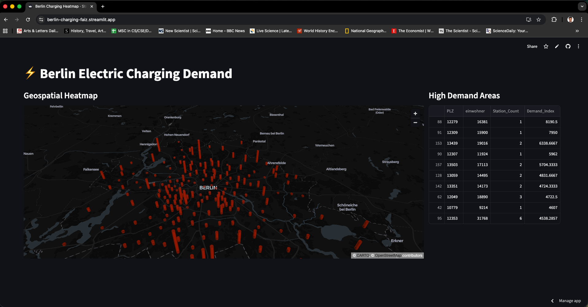

# ⚡ Berlin Electric Charging Demand Heatmap

## 1. Project Overview
This Data Science web application visualizes the demand for electric vehicle (EV) charging infrastructure in Berlin. By correlating population density data with the federal registry of charging stations, the project identifies "blind spots"—districts with high population density but insufficient charging infrastructure.

* **Live Deployment:** [INSERT YOUR STREAMLIT APP LINK HERE]
* **GitHub Repository:** [INSERT YOUR GITHUB LINK HERE]

---

## 2. Technical Structure ("What Means What")

The project follows a modular Python structure designed for Streamlit.

### **File Architecture**
* **`main.py` (The Core Application):**
    * **Role:** The entry point of the application.
    * **Functionality:** It handles the ETL pipeline (Extract, Transform, Load). It loads raw CSVs, filters for Berlin postal codes, merges datasets, calculates the demand index, and renders the 3D map using PyDeck.
* **`config.py` (Configuration):**
    * **Role:** Stores file paths and global constants.
    * **Benefit:** Allows switching datasets without breaking the main application logic.
* **`datasets/`:** Folder containing the raw CSV data (Population, Charging Registry, Geodata).

### **Key Variables & Metrics**
The analysis relies on specific metrics calculated in the final DataFrame (`gdf_residents2`):

| Variable | Description | Meaning |
| :--- | :--- | :--- |
| **`PLZ`** | **Postleitzahl** (Zip Code) | Unique identifier for Berlin districts, acting as the primary key for merging. |
| **`einwohner`** | **Population** | Total registered residents in that PLZ. |
| **`Station_Count`** | **Supply** | Total number of public charging points available in that PLZ. |
| **`Demand_Index`** | **Pressure Metric** | A calculated score representing the strain on the infrastructure. |

---

## 3. Methodology

### **Data Processing**
Here is a preview of the processed data merging population, charging stations, and the calculated Demand Index:



### **The Algorithm**
To quantify the "need" for infrastructure, we calculate a **Demand Index** for every Postal Code using the following logic:

1.  **Filter:** Isolate data rows where `PLZ` starts with "1..." (Berlin Region).
2.  **Aggregate:** Count total charging stations per PLZ.
3.  **Calculate:** Apply the demand formula:

$$\text{Demand Index} = \frac{\text{Population}}{\text{Station Count} + 1}$$

> **Note:** We add `+1` to the denominator to prevent "Division by Zero" errors in districts that have 0 stations. This effectively models the load if *one* station were to be built there.

---

## 4. Analysis of Results (Task 7)

The geospatial analysis reveals a significant mismatch between population centers and infrastructure distribution.

### **Visual Result**

*(Figure 1: 3D Visualization of Demand Index. Red bars indicate high pressure on infrastructure.)*

### **A. Identified "Hotspots" (High Demand)**
The visualization shows that the highest demand is **not** in the city center (Mitte), but in the **outer residential rings**.
* **Top Priority:** **PLZ 12279 (Marienfelde)**.
    * **Population:** 16,381
    * **Stations:** 1
    * **Demand Index:** **~8,190**
    * **Interpretation:** Over 16,000 residents are competing for a single public charging point.
* **Secondary Priority:** **PLZ 12309 (Lichtenrade)**.
    * **Population:** 15,900
    * **Stations:** 1
    * **Interpretation:** Extremely high pressure on grid; urgent need for expansion.

### **B. Geospatial Patterns**
* **The "Donut" Effect:** The map displays a ring of tall red bars (high demand) surrounding the city center. These areas (PLZ 12xxx, 13xxx) typically feature dense housing complexes (*Plattenbauten*) where residents lack private garages, increasing the reliance on public charging.
* **Low Demand Areas:** Wealthier suburbs like **Zehlendorf** show low demand indices. Despite having fewer stations, the need is lower because residents likely own single-family homes with private wall-boxes.

---

## 5. Data Sources
1.  **Charging Stations:** *Ladesäulenregister* (Bundesnetzagentur). Filtered for Berlin.
2.  **Population Data:** Census data per PLZ derived from *suche-postleitzahl.org*.
3.  **Geodata:** Latitude/Longitude centroid coordinates for Berlin PLZ boundaries.

---

## 6. Setup & Installation
To run this project locally:

```bash
# 1. Clone the repo
git clone [YOUR REPO URL]

# 2. Install dependencies
pip install -r requirements.txt

# 3. Run the app
streamlit run main.py