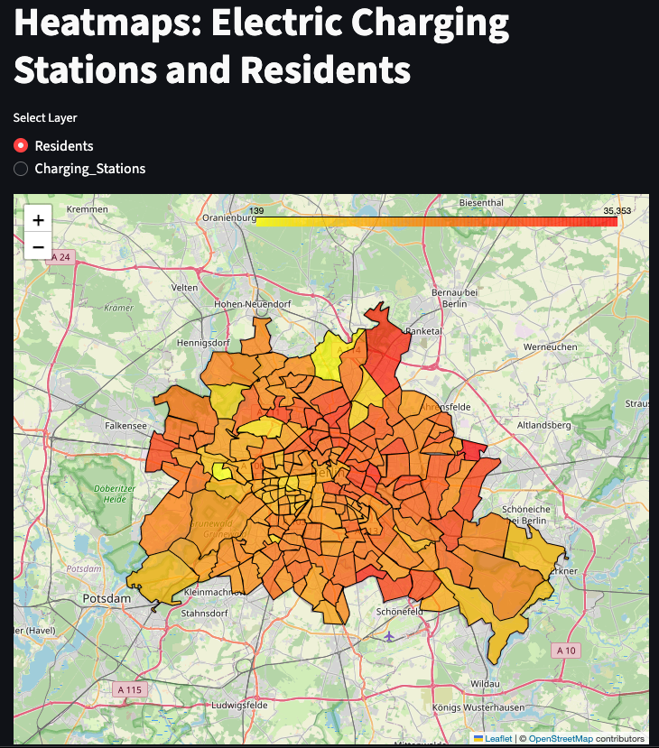

# ⚡ Berlin Electric Charging Demand Heatmap

## 1. Project Overview
This Data Science web application visualizes the demand for electric vehicle (EV) charging infrastructure in Berlin. By correlating population density data with the federal registry of charging stations, the project identifies "blind spots"—districts with high population density but insufficient charging infrastructure.

* **Live Deployment:** [https://berlin-charging-faiz.streamlit.app](https://berlin-charging-faiz.streamlit.app)
* **GitHub Repository:** [https://github.com/foyzullah-faiz/berlin-charging-heatmap](https://github.com/foyzullah-faiz/berlin-charging-heatmap)

---

## 2. Technical Structure

The project follows a modular Python structure designed for Streamlit.

* **`main.py`:** The entry point. It loads data, calls the processing methods, and renders the visualizations.
* **`core/methods.py`:** Contains the reusable logic for cleaning data, converting types, and generating the Folium map layers.
* **`config.py`:** Manages file paths and global constants.
* **`datasets/`:** Raw CSV data (Population, Charging Registry, Geodata).

---

## 3. Methodology & Algorithm

To quantify the "need" for infrastructure, we calculate a **Demand Index** for every Postal Code (PLZ) using the following logic:

1.  **Filter:** Isolate data rows where `PLZ` starts with "1..." (Berlin Region).
2.  **Aggregate:** Count total charging stations per PLZ.
3.  **Calculate:** Apply the demand formula:

$$\text{Demand Index} = \frac{\text{Population}}{\text{Station Count} + 1}$$

### **Data Preview**
Here is a preview of the processed data merging population, charging stations, and the calculated Demand Index:


---

## 4. Visualizations

The application supports two different geospatial visualization approaches.

### **Approach A: 2D Interactive Heatmap (Folium)**
*Required for Task 3.*
This view allows users to toggle layers to compare population density vs. charging station density directly.

**Layer 1: Residents (Population Density)**
*Yellow/Red intensity indicates where people live.*


**Layer 2: Charging Stations (Infrastructure Supply)**
*Yellow/Red intensity indicates where chargers are located.*


### **Approach B: 3D Geospatial Column Map (PyDeck)**
*Advanced Visualization.*
This view renders the **Demand Index** as physical height.
* **Red Towers:** Indicate areas with high pressure on infrastructure (High Population / Low Stations).
* **Height:** Proportional to the Demand Index.


---

## 5. Analysis of Results (Task 7)

The geospatial analysis reveals a significant mismatch between population centers and infrastructure distribution.

### **Identified "Hotspots" (High Demand)**
The visualization shows that the highest demand is **not** in the city center (Mitte), but in the **outer residential rings**.

1.  **Top Priority:** **PLZ 12279 (Marienfelde)**.
    * **Population:** 16,381
    * **Stations:** 1
    * **Interpretation:** Over 16,000 residents are competing for a single public charging point.
2.  **Secondary Priority:** **PLZ 12309 (Lichtenrade)**.
    * **Population:** 15,900
    * **Stations:** 1
    * **Interpretation:** Extremely high pressure on grid; urgent need for expansion.

### **Geospatial Patterns**
* **The "Donut" Effect:** The map displays a ring of high demand surrounding the city center. These areas (PLZ 12xxx, 13xxx) typically feature dense housing complexes (*Plattenbauten*) where residents lack private garages.
* **Low Demand Areas:** Wealthier suburbs like **Zehlendorf** show low demand indices. Despite having fewer stations, the need is lower because residents likely own single-family homes with private wall-boxes.

---

## 6. Setup & Installation
To run this project locally:

```bash
# 1. Clone the repo
git clone [https://github.com/foyzullah-faiz/berlin-charging-heatmap.git](https://github.com/foyzullah-faiz/berlin-charging-heatmap.git)

# 2. Install dependencies
pip install -r requirements.txt

# 3. Run the app
streamlit run main.py