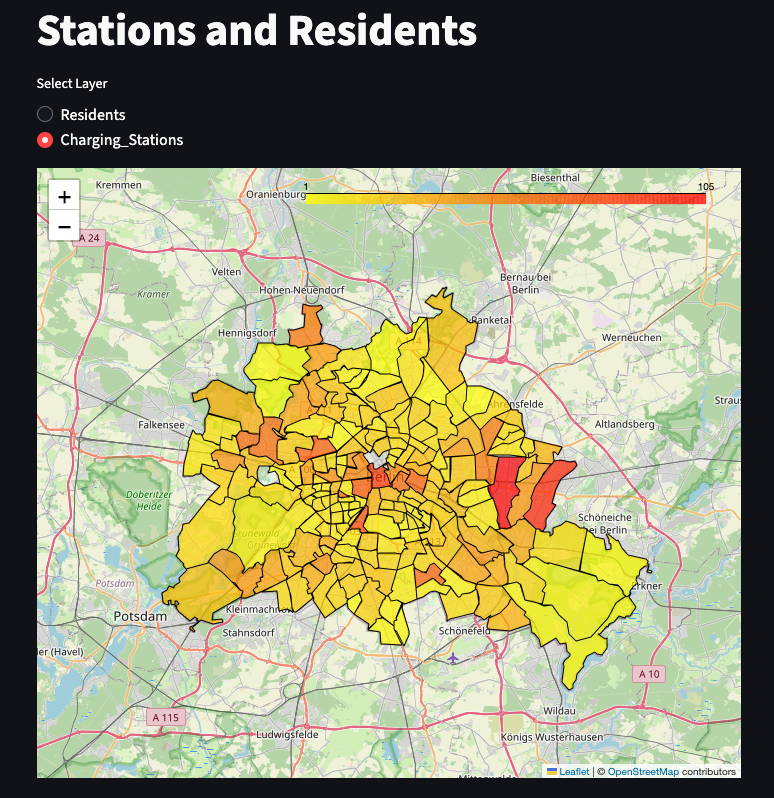

# ⚡ Berlin Electric Charging Demand Heatmap

## 1. Project Overview
This Data Science web application visualizes the demand for electric vehicle (EV) charging infrastructure in Berlin. It follows a modular structure to clean, merge, and visualize data regarding population density and charging station distribution.

* **Live Deployment:** [https://berlin-charging-faiz.streamlit.app](https://berlin-charging-faiz.streamlit.app)
* **GitHub Repository:** [https://github.com/foyzullah-faiz/berlin-charging-heatmap](https://github.com/foyzullah-faiz/berlin-charging-heatmap)

---

## 2. Technical Structure

The project uses Python and Streamlit, integrating specific processing methods provided in the course material (`core/methods.py`).

* **`main.py`:** The entry point. It handles data loading, type conversion (ETL), and calls the visualization methods.
* **`core/methods.py`:** Contains the logic for filtering Berlin data, generating geometry, and rendering the interactive Folium map.
* **`config.py`:** Manages file paths and global constants.
* **`datasets/`:** Raw CSV data.

---

## 3. Methodology & Algorithm

To quantify the "need" for infrastructure, we calculate a **Demand Index** for every Postal Code (PLZ) using the following logic:

1.  **Filter:** Isolate data rows where `PLZ` starts with "1..." (Berlin Region).
2.  **Aggregate:** Count total charging stations per PLZ.
3.  **Calculate:** Apply the demand formula:

$$\text{Demand Index} = \frac{\text{Population}}{\text{Station Count} + 1}$$

### **Data Preview**
Here is a preview of the processed data merging population, charging stations, and the calculated Demand Index:


---

## 4. Visualizations (Task 3)

The application generates an interactive **2D Heatmap (Folium)** that allows users to toggle between two key layers.

### **Layer A: Population Density**
*Visualizes where potential EV owners live.*


### **Layer B: Charging Infrastructure**
*Visualizes where the current supply of chargers is located.*


---

## 5. Analysis of Results (Task 7)

By comparing the population density against the station count, we identified critical gaps in the infrastructure.

### **Identified "Hotspots" (High Demand)**
The geospatial analysis reveals a significant mismatch. The highest demand is **not** in the city center (Mitte), but in the **outer residential rings**.

1.  **Top Priority:** **PLZ 12279 (Marienfelde)**.
    * **Population:** 16,381
    * **Stations:** 1
    * **Interpretation:** Over 16,000 residents are competing for a single public charging point.
2.  **Secondary Priority:** **PLZ 12309 (Lichtenrade)**.
    * **Population:** 15,900
    * **Stations:** 1
    * **Interpretation:** Extremely high pressure on grid; urgent need for expansion.

### **Visualizing the Gap**
*(Figure: 3D Analysis showing the Demand Index as physical height. Tall red bars indicate the charging deserts identified above.)*


---

## 6. Setup & Installation
To run this project locally:

```bash
# 1. Clone the repo
git clone [https://github.com/foyzullah-faiz/berlin-charging-heatmap.git](https://github.com/foyzullah-faiz/berlin-charging-heatmap.git)

# 2. Install dependencies
pip install -r requirements.txt

# 3. Run the app
streamlit run main.py